# 🤖 Многоагентная Интеллектуальная Система

## 📋 Описание проекта

Многоагентная интеллектуальная система - это распределенная платформа на основе Docker, которая объединяет несколько специализированных AI-агентов для автоматизации процессов разработки программного обеспечения. Система включает в себя агентов для управления проектами, архитектурного проектирования, написания кода, ревью и документирования, а также инструменты для оркестрации и мониторинга.

### 🏗️ Архитектура системы

Система состоит из следующих компонентов:

- **OpenRouter Proxy Server** - прокси-сервер для взаимодействия с языковыми моделями
- **Project Manager Agent** - координатор работы всех агентов
- **Architect Agent** - агент для проектирования архитектуры систем
- **Code Writer Agent** - агент для написания и генерации кода
- **Code Reviewer Agent** - агент для ревью и анализа кода
- **Documentation Agent** - агент для генерации и управления документацией
- **n8n** - платформа автоматизации рабочих процессов
- **CloudPub** - туннель для публикации вебхуков
- **Prometheus** - система сбора метрик
- **Grafana** - платформа визуализации метрик и дашбордов

### 🎯 Схема взаимодействия агентов

```plantuml
@startuml
!define RECTANGLE class

skinparam component {
  ArrowColor #666
  BorderColor #666
  BackgroundColor #f9f9f9
}

skinparam rectangle {
  BorderColor #333
  BackgroundColor #e1f5fe
}

' Внешние системы
rectangle "GitHub" as github {
  (Репозитории)
  (Pull Request)
  (Issues)
}

rectangle "n8n" as n8n {
  (Оркестрация)
  (Рабочие процессы)
  (Автоматизация)
}

rectangle "Grafana" as grafana {
  (Дашборды)
  (Визуализация)
}

rectangle "Prometheus" as prometheus {
  (Метрики)
  (Мониторинг)
}

' Proxy Server
rectangle "Proxy Server" as mcp {
  (Коммуникация)
  (Маршрутизация)
  (Протокол)
}

' Агенты
rectangle "Project Manager Agent" as pm {
  (Координация)
  (Управление задачами)
  (Оркестрация)
}

rectangle "Architect Agent" as architect {
  (Проектирование)
  (Архитектура)
  (Анализ)
}

rectangle "Code Writer Agent" as codewriter {
  (Генерация кода)
  (Разработка)
  (Рефакторинг)
}

rectangle "Code Reviewer Agent" as reviewer {
  (Ревью кода)
  (Анализ качества)
  (Тестирование)
}

rectangle "Documentation Agent" as docs {
  (Генерация док.)
  (Управление)
  (Обновление)
}

' Взаимодействия
pm --> mcp : Управление
architect --> mcp : Запросы/Ответы
codewriter --> mcp : Код/Результаты
reviewer --> mcp : Анализ/Отчеты
docs --> mcp : Док./Обновления

mcp --> pm : Координация
mcp --> architect : Задачи
mcp --> codewriter : Требования
mcp --> reviewer : Код на ревью
mcp --> docs : Данные для док.

' Взаимодействие с внешними системами
pm --> github : Управление PR
pm --> n8n : Орхестрация процессов

architect --> github : Анализ арх-ры
codewriter --> github : Push кода
reviewer --> github : PR ревью
docs --> github : README/док.

n8n --> pm : Триггеры
n8n --> architect : Автоматизация
n8n --> codewriter : CI/CD
n8n --> reviewer : Авто-ревью
n8n --> docs : Авто-док.

' Мониторинг
pm --> prometheus : Метрики
architect --> prometheus : Метрики
codewriter --> prometheus : Метрики
reviewer --> prometheus : Метрики
docs --> prometheus : Метрики

prometheus --> grafana : Данные
grafana --> pm : Дашборды
grafana --> architect : Дашборды
grafana --> codewriter : Дашборды
grafana --> reviewer : Дашборды
grafana --> docs : Дашборды

' Стиль для выделения центральной роли
skinparam rectangle {
  pm #fff3e0
  mcp #e8f5e8
}

@enduml
```



## 📋 Системные требования

- **Docker** версии 20.10 или выше
- **Docker Compose** версии 2.0 или выше
- Минимум **4 ГБ** оперативной памяти
- Минимум **10 ГБ** свободного дискового пространства
- Доступ в интернет для загрузки Docker-образов и взаимодействия с API

## 🔌 Необходимые свободные порты

Для корректной работы системы убедитесь, что следующие порты свободны:

| Компонент | Порт | Назначение |
|-----------|------|------------|
| OpenRouter Proxy Server | 8000 | API для взаимодействия с LLM |
| Project Manager Agent | 8001 | API менеджера проектов |
| Architect Agent | 8002 | API архитектора |
| Code Writer Agent | 8003 | API написания кода |
| Code Reviewer Agent | 8004 | API ревью кода |
| Documentation Agent | 8005 | API документации |
| n8n | 5678 | Веб-интерфейс автоматизации |
| Prometheus | 9090 | Веб-интерфейс метрик |
| Grafana | 3000 | Веб-интерфейс дашбордов |

## 🚀 Пошаговые инструкции по запуску

### 1. Клонирование репозитория

```bash
git clone https://github.com/Kaze-nomi/MultiAgentIntelligentSystem
cd MultiAgentIntelligentSystem
```

### 2. Настройка переменных окружения

Скопируйте файл примера переменных окружения и отредактируйте его:

```bash
cp .env.example .env
```

Откройте файл `.env` в текстовом редакторе и заполните следующие параметры:

```bash
# API ключ для OpenRouter
OPENROUTER_API_KEY=your_openrouter_api_key_here

# Модель по умолчанию
DEFAULT_MODEL=anthropic/claude-3-haiku

# Токен для CloudPub
CLOUDPUB_TOKEN=your_cloudpub_token_here

# Токен бота Telegram
TELEGRAM_BOT_TOKEN=your_telegram_bot_token_here

# Токен GitHub
GITHUB_TOKEN=your_github_token_here
```

**Важно:** Параметры `OPENROUTER_API_KEY` и `DEFAULT_MODEL` являются обязательными для работы системы.

### 3. Запуск через docker-compose

Выполните следующую команду для запуска всех компонентов системы:

```bash
docker-compose up -d
```

Эта команда запустит все сервисы в фоновом режиме. Для просмотра логов в реальном времени используйте:

```bash
docker-compose logs -f
```

Для просмотра логов конкретного сервиса:

```bash
docker-compose logs -f [имя_сервиса]
```

Например, для просмотра логов менеджера проектов:

```bash
docker-compose logs -f project-manager
```

### 4. Проверка работоспособности

После запуска системы проверьте доступность всех компонентов:

1. **Проверка здоровья агентов:**
   ```bash
   curl http://localhost:8001/health  # Project Manager
   curl http://localhost:8002/health  # Architect
   curl http://localhost:8003/health  # Code Writer
   curl http://localhost:8004/health  # Code Reviewer
   curl http://localhost:8005/health  # Documentation
   ```

2. **Проверка веб-интерфейсов:**
   - Откройте в браузере http://localhost:5678 для доступа к n8n
   - Откройте в браузере http://localhost:3000 для доступа к Grafana
   - Откройте в браузере http://localhost:9090 для доступа к Prometheus

3. **Проверка статуса контейнеров:**
   ```bash
   docker-compose ps
   ```

## 🌐 Доступ к компонентам системы

### n8n - Платформа автоматизации

- **URL:** http://localhost:5678
- **Назначение:** Создание и управление рабочими процессами
- **Особенности:** Предварительно настроенные рабочие процессы для многоагентной разработки

### Grafana - Визуализация метрик

- **URL:** http://localhost:3000
- **Логин:** admin
- **Пароль:** admin
- **Назначение:** Мониторинг производительности и состояния всех агентов
- **Особенности:** Предварительно настроенные дашборды для визуализации метрик

### Prometheus - Сбор метрик

- **URL:** http://localhost:9090
- **Назначение:** Сбор и хранение метрик со всех компонентов системы
- **Особенности:** Автоматическая конфигурация для мониторинга всех агентов

### AI-агенты

#### Project Manager (Менеджер проектов)
- **Порт:** 8001
- **API:** http://localhost:8001
- **Назначение:** Координация работы всех агентов, управление задачами

#### Architect (Архитектор)
- **Порт:** 8002
- **API:** http://localhost:8002
- **Назначение:** Проектирование архитектуры систем

#### Code Writer (Написание кода)
- **Порт:** 8003
- **API:** http://localhost:8003
- **Назначение:** Генерация и написание кода

#### Code Reviewer (Ревью кода)
- **Порт:** 8004
- **API:** http://localhost:8004
- **Назначение:** Анализ и ревью кода

#### Documentation (Документация)
- **Порт:** 8005
- **API:** http://localhost:8005
- **Назначение:** Генерация и управление документацией

## 💡 Примеры использования системы

### Пример 1: Создание нового проекта

1. Откройте n8n (http://localhost:5678)
2. Выберите рабочий процесс "Multi-Agent Development System"
3. Запустите процесс, указав параметры нового проекта
4. Система автоматически:
   - Создаст архитектуру проекта через Architect Agent
   - Сгенерирует базовый код через Code Writer Agent
   - Проведет ревью кода через Code Reviewer Agent
   - Создаст документацию через Documentation Agent

### Пример 2: Анализ существующего кода

1. Откройте n8n (http://localhost:5678)
2. Выберите рабочий процесс "PR Review System"
3. Укажите ссылку на репозиторий или загрузите код
4. Система автоматически:
   - Проанализирует код через Code Reviewer Agent
   - Предложит улучшения через Architect Agent
   - Создаст отчет через Documentation Agent

### Пример 3: Мониторинг производительности

1. Откройте Grafana (http://localhost:3000)
2. Перейдите к дашборду "Multi-Agent Dashboard"
3. Наблюдайте за метриками:
   - Время отклика агентов
   - Количество обработанных запросов
   - Использование ресурсов
   - Статус здоровья сервисов

## 📚 Дополнительная информация

### Структура проекта

```
MultiAgentIntelligentSystem/
├── agents/                     # Директория с агентами
│   ├── architect_agent/        # Агент архитектора
│   ├── code_reviewer_agent/    # Агент ревью кода
│   ├── code_writer_agent/      # Агент написания кода
│   ├── documentation_agent/   # Агент документации
│   └── project_manager_agent/ # Агент менеджера проектов
├── monitoring/                 # Конфигурация мониторинга
│   ├── grafana/               # Конфигурация Grafana
│   └── prometheus.yaml        # Конфигурация Prometheus
├── n8n_workflows/             # Рабочие процессы n8n
├── openrouter_proxy/            # Proxy сервер для OpenRouter
├── docker-compose.yaml        # Основной файл Docker Compose
├── .env.example              # Пример переменных окружения
└── README.md                 # Этот файл
```

### Логирование

Все логи системы сохраняются в директории `./logs` и доступны через:

```bash
# Просмотр всех логов
tail -f logs/all.log

# Просмотр логов конкретного сервиса
docker-compose logs -f [имя_сервиса]
```