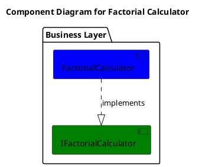
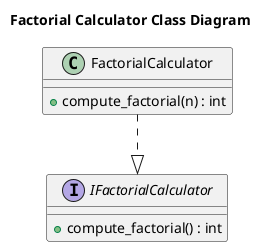

# Документация архитектуры системы

## Table of Contents

1. [Обзор архитектуры](#обзор-архитектуры)
2. [Компоненты и их ответственности](#компоненты-и-их-ответственности)
3. [Слои приложения](#слои-приложения)
4. [Паттерны проектирования](#паттерны-проектирования)
5. [Структура проекта](#структура-проекта)
6. [Зависимости между компонентами](#зависимости-между-компонентами)
7. [Диаграммы](#диаграммы)
8. [Решения и обоснования (ADR)](#решения-и-обоснования-adr)

## Обзор архитектуры

Архитектура системы построена на принципах микросервисной архитектуры с использованием мультиагентной системы. Основной компонент — `FactorialCalculator`, который представляет собой сервис для вычисления факториала неотрицательного целого числа. Сервис реализован на языке Python с использованием фреймворка Pydantic для валидации данных. Архитектура следует паттернам мультиагентной системы, где агенты (например, Project Manager Agent, Code Writer Agent) взаимодействуют с сервисом через оркестрацию, зависимости или автоматизацию.

Система интегрируется с существующими компонентами, такими как агенты и n8n Workflows, для демонстрации, тестирования и мониторинга. Рекомендации включают оптимизацию производительности, безопасность и расширяемость.

## Компоненты и их ответственности

### FactorialCalculator
- **Тип**: service
- **Описание**: Сервис для вычисления факториала числа.
- **Ответственность**: Вычисление факториала неотрицательного целого числа с использованием рекурсивного или итеративного подхода.
- **Методы**:
  - `compute_factorial(n: int) -> int`: Вычисляет факториал числа n. Параметры: n (неотрицательное целое число, обязательный). Возвращает int. Может вызывать ValueError.
- **Интерфейсы**: Реализует `IFactorialCalculator`.
- **Слой**: business

## Слои приложения

- **Business Layer**: Содержит логику вычислений, включая `FactorialCalculator` и интерфейс `IFactorialCalculator`. Этот слой отделяет вычислительную логику от других слоев, следуя принципам Clean Architecture.

## Паттерны проектирования

В системе используются следующие паттерны:
- **Strategy**: Для выбора различных алгоритмов вычисления факториала (рекурсивный или итеративный).
- **Template Method**: Для структурирования процесса вычисления с общими шагами.
- **Decorator**: Для добавления дополнительной функциональности, такой как логирование или кэширование.
- **Factory Method**: Для создания экземпляров `FactorialCalculator` с различными конфигурациями.

## Структура проекта

Структура файлов организована по пакетам:

- `business/factorial_calculator/__init__.py`: Инициализация пакета, реэкспорт публичного API (`FactorialCalculator`, `IFactorialCalculator`).
- `business/factorial_calculator/factorial_calculator.py`: Реализация сервиса `FactorialCalculator`.
- `business/factorial_calculator/ifactorial_calculator.py`: Интерфейс `IFactorialCalculator`.
- `tests/test_factorial_calculator.py`: Тесты для `FactorialCalculator`.

## Зависимости между компонентами

- `FactorialCalculator` зависит от `IFactorialCalculator` (реализует интерфейс).
- Интеграция с существующими компонентами:
  - **Project Manager Agent**: Оркестрирует `FactorialCalculator` для задач по генерации и тестированию.
  - **Code Writer Agent**: Использует `FactorialCalculator` для генерации примеров кода.
  - **n8n Workflows**: Автоматизирует вызовы `FactorialCalculator`.
  - **Monitoring Stack**: Отслеживает метрики `FactorialCalculator`.

## Диаграммы

### Component Diagram

### Class Diagram

## Решения и обоснования (ADR)

### Точки интеграции
- **Project Manager Agent**: Интеграция через оркестрацию для координации задач. Требуемые изменения: обновление `agents/project_manager_agent/server.py` и `models.py`.
- **Code Writer Agent**: Зависимость для генерации кода. Требуемые изменения: обновление `agents/code_writer_agent/server.py` и `models.py`.
- **n8n Workflows**: Автоматизация вызовов. Требуемые изменения: добавление нового workflow-файла.
- **Monitoring Stack**: Мониторинг метрик. Требуемые изменения: обновление конфигурации Prometheus.

### Рекомендации
- Внедрить domain/business logic слой для разделения логики.
- Добавить unit- и интеграционные тесты с pytest или unittest.
- Оптимизировать производительность с memoization и асинхронной обработкой.
- Обеспечить безопасность через валидацию и rate limiting.
- Повысить расширяемость с паттерном Strategy и плагинами.
- Уменьшить дублирование кода через shared library.
- Улучшить развертывание с Docker и CI/CD.