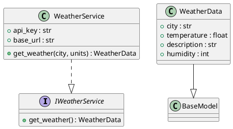

# Документация архитектуры системы погоды

## Table of Contents

1. [Обзор архитектуры](#обзор-архитектуры)
2. [Компоненты и их ответственности](#компоненты-и-их-ответственности)
3. [Слои приложения](#слои-приложения)
4. [Паттерны проектирования](#паттерны-проектирования)
5. [Структура проекта](#структура-проекта)
6. [Зависимости между компонентами](#зависимости-между-компонентами)
7. [Диаграммы](#диаграммы)
8. [Решения и обоснования (ADR)](#решения-и-обоснования-adr)

## Обзор архитектуры

Архитектура системы погоды основана на микросервисном подходе с использованием паттерна агент-based. Основные компоненты включают сервис для получения данных о погоде (WeatherService) и модель данных (WeatherData). Система интегрируется с внешними API (например, OpenWeatherMap) для получения актуальной информации о погоде. Архитектура разделена на слои: business (бизнес-логика), data (модели данных) и interfaces (интерфейсы). Используется язык Python с фреймворком Pydantic для валидации данных. Система поддерживает интеграцию с существующими компонентами, такими как ProjectManagerAgent, Monitoring и OpenRouterProxy, для расширения функциональности.

## Компоненты и их ответственности

### WeatherService
- **Тип**: service
- **Описание**: Сервис для получения данных о погоде из внешнего API.
- **Ответственность**: Получение текущей погоды по городу или координатам, обработка ответов и возврат структурированных данных.
- **Свойства**:
  - `api_key` (str, required, private): Ключ API для внешнего сервиса погоды.
  - `base_url` (str, required, default: "https://api.openweathermap.org/data/2.5/weather"): Базовый URL внешнего API погоды.
- **Методы**:
  - `get_weather(city: str, units: str = "metric") -> WeatherData`: Получает данные о погоде по названию города. Может вызывать исключения WeatherAPIError или ValueError.
- **Интерфейсы**: Реализует IWeatherService.
- **Зависимости**: requests.
- **Слой**: business.

### WeatherData
- **Тип**: class
- **Описание**: Модель данных погоды.
- **Ответственность**: Представление структурированных данных о погоде.
- **Свойства**:
  - `city` (str, required): Название города.
  - `temperature` (float, required): Температура в градусах.
  - `description` (str, required): Описание погоды (например, 'clear sky').
  - `humidity` (int, required): Влажность в процентах.
- **Наследование**: Extends BaseModel.
- **Зависимости**: pydantic.
- **Слой**: data.

## Слои приложения

Архитектура разделена на следующие слои:

- **Business Layer (business)**: Содержит бизнес-логику, такую как WeatherService, который реализует интерфейсы и обрабатывает запросы.
- **Data Layer (data)**: Включает модели данных, такие как WeatherData, для структурирования информации.
- **Interfaces Layer (interfaces)**: Определяет контракты, такие как IWeatherService, для обеспечения абстракции.
- **Tests Layer (tests)**: Содержит тесты для компонентов.

Это разделение обеспечивает четкость, тестируемость и возможность замены реализаций.

## Паттерны проектирования

В архитектуре используются следующие паттерны:

- **Adapter**: Для адаптации внешнего API погоды к внутренней структуре данных.
- **Strategy**: Для выбора различных стратегий получения данных (например, по городу или координатам).
- **Repository**: Для абстракции доступа к данным, хотя в текущей реализации это не явно выражено, но может быть расширено для кеширования или других источников.

## Структура проекта

Проект организован в виде пакетов с четкой иерархией:

- `interfaces/`: Пакет для интерфейсов.
  - `__init__.py`: Инициализация пакета, реэкспорт IWeatherService.
  - `i_weather_service.py`: Модуль с интерфейсом IWeatherService.
- `data/`: Пакет для моделей данных.
  - `__init__.py`: Инициализация пакета, реэкспорт WeatherData.
  - `weather_data.py`: Модуль с моделью WeatherData.
- `business/`: Пакет для бизнес-логики.
  - `__init__.py`: Инициализация пакета, реэкспорт WeatherService.
  - `weather_service.py`: Модуль с сервисом WeatherService, импортирующим из interfaces и data.
- `tests/`: Пакет для тестов.
  - `test_weather_service.py`: Тесты для WeatherService.
  - `test_weather_data.py`: Тесты для WeatherData.

## Зависимости между компонентами

- WeatherService зависит от IWeatherService (реализует интерфейс) и WeatherData (использует для возврата данных).
- WeatherData наследуется от BaseModel из pydantic.
- WeatherService использует библиотеку requests для HTTP-запросов.
- Интеграция с существующими компонентами:
  - ProjectManagerAgent зависит от WeatherService для получения данных о погоде.
  - Monitoring интегрирует метрики WeatherService.
  - OpenRouterProxy использует WeatherData для передачи данных.

## Диаграммы

### Component Diagram

```plantuml
@startuml
title Weather System Component Diagram

package "Business Layer" {
    component WeatherService as WS <<service>> #LightBlue
    interface IWeatherService as IWS #LightYellow
    component DocumentationAgent as DA <<service>> #LightGreen
}

package "Data Layer" {
    class WeatherData as WD #LightGray
}

WS ..|> IWS : implements
WS ..> WD : depends on
DA ..> WS : depends on

@enduml
```

### Class Diagram



## Решения и обоснования (ADR)

### ADR 1: Внедрение Clean Architecture
**Решение**: Разделить архитектуру на слои (domain, application, infrastructure) для четкого разделения бизнес-логики и инфраструктурных деталей.  
**Обоснование**: Указанные слабости архитектуры включают смешивание логики, что может привести к сложности поддержки. Clean Architecture обеспечит модульность и тестируемость.

### ADR 2: Создание общего модуля для моделей
**Решение**: Внедрить shared models library для устранения дублирования моделей между агентами.  
**Обоснование**: В микросервисной архитектуре дублирование кода моделей снижает консистентность; общий модуль обеспечит единообразие.

### ADR 3: Добавление unit-тестов и интеграционных тестов
**Решение**: Использовать pytest для покрытия WeatherService и WeatherData, включая сценарии сбоев внешних API.  
**Обоснование**: Тесты повысят надежность и позволят обнаруживать ошибки на ранних этапах.

### ADR 4: Внедрение кеширования данных погоды
**Решение**: Добавить кеширование с Redis для данных погоды.  
**Обоснование**: Снижает нагрузку на внешние API и улучшает производительность при частых запросах.

### ADR 5: Обеспечение безопасности API
**Решение**: Внедрить валидацию входных данных, использование API-ключей и rate limiting.  
**Обоснование**: Предотвращает злоупотребления и атаки DoS на сервис погоды.

### ADR 6: Сделать WeatherService интерфейсом с подменой реализаций
**Решение**: Реализовать IWeatherService с возможностью выбора провайдеров погоды.  
**Обоснование**: Повышает расширяемость, позволяя легко добавлять новые источники без изменений кода.

### ADR 7: Улучшение коммуникации между агентами
**Решение**: Внедрить асинхронные паттерны с Kafka или RabbitMQ и мониторинг с Prometheus.  
**Обоснование**: Минимизирует риски сбоев в распределенной среде и улучшает надежность.

### ADR 8: Интеграция с существующими компонентами
**Решение**: Добавить WeatherService в ProjectManagerAgent, интегрировать метрики в Monitoring и использовать WeatherData в OpenRouterProxy.  
**Обоснование**: Расширяет функциональность системы, обеспечивая использование погодных данных в планировании задач и генерации контента.