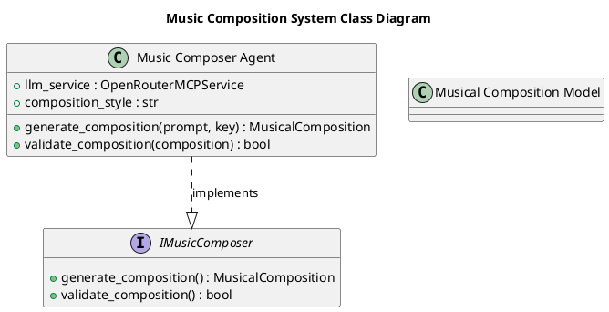

# Документация архитектуры Music Composer Agent

## Table of Contents

1. [Обзор архитектуры](#обзор-архитектуры)
2. [Компоненты и их ответственности](#компоненты-и-их-ответственности)
3. [Слои приложения](#слои-приложения)
4. [Паттерны проектирования](#паттерны-проектирования)
5. [Структура проекта](#структура-проекта)
6. [Зависимости между компонентами](#зависимости-между-компонентами)
7. [Диаграммы](#диаграммы)
8. [Решения и обоснования (ADR)](#решения-и-обоснования-adr)

## Обзор архитектуры

Система Music Composer Agent представляет собой микросервисную архитектуру, основанную на агентном подходе, предназначенную для генерации музыкальных композиций. Основной компонент — Music Composer Agent — взаимодействует с внешними сервисами, такими как OpenRouter MCP Server для доступа к LLM API, и использует модели данных для представления композиций. Архитектура разделена на слои: бизнес-логика (business layer) и данные (data layer), что обеспечивает модульность и разделение ответственности. Интеграция с существующими компонентами, такими как Project Manager Agent, позволяет включать генерацию музыки в более широкий workflow проекта.

## Компоненты и их ответственности

### Music Composer Agent
- **Тип**: service
- **Описание**: Генерирует музыкальные композиции, такие как вальсы, на основе запросов, используя LLM сервисы для создания текстовых представлений нот или описаний.
- **Свойства**:
  - `llm_service` (OpenRouterMCPService): Экземпляр сервиса для взаимодействия с LLM (обязательно).
  - `composition_style` (str): Стиль композиции, например, 'classical' (обязательно, по умолчанию 'classical').
- **Методы**:
  - `generate_composition(prompt: str, key: str = "C minor") -> MusicalComposition`: Асинхронно генерирует композицию на основе запроса. Может вызвать `CompositionGenerationError`.
  - `validate_composition(composition: MusicalComposition) -> bool`: Проверяет корректность сгенерированной композиции.
- **Интерфейсы**: Реализует `IMusicComposer`.
- **Зависимости**: OpenRouter MCP Server, Logging Config.
- **Слой**: business.

### Musical Composition Model
- **Тип**: class
- **Описание**: Определяет структуры данных для музыкальных композиций, таких как ноты, мелодии и метаданные.
- **Свойства**: Нет.
- **Методы**: Нет.
- **Слой**: data.

## Слои приложения

Архитектура разделена на два основных слоя:

- **Business Layer**: Содержит логику агентов и сервисов. Включает Music Composer Agent, который обрабатывает запросы и взаимодействует с внешними зависимостями.
- **Data Layer**: Отвечает за модели данных. Включает Musical Composition Model для представления структур музыкальных композиций.

Это разделение обеспечивает четкое разделение ответственности: бизнес-логика отделена от хранения и обработки данных.

## Паттерны проектирования

В архитектуре используются следующие паттерны:

- **Strategy**: Для выбора различных стратегий генерации композиций (например, разные стили).
- **Builder**: Для пошагового построения музыкальных композиций.
- **Composite**: Для составления сложных структур из простых элементов (например, мелодии из нот).
- **Repository**: Для абстракции доступа к данным композиций.
- **Facade**: Для упрощения интерфейса взаимодействия с внешними сервисами, такими как LLM.

## Структура проекта

Проект организован в пакет `music_composer_agent` с модульной структурой:

- `music_composer_agent/__init__.py`: Инициализация пакета, реэкспорт публичного API (MusicalCompositionModel, MusicComposerAgent, IMusicComposer). Импортирует из models, server, interfaces.
- `music_composer_agent/models.py`: Модель данных для музыкальной композиции (data layer). Содержит MusicalCompositionModel.
- `music_composer_agent/server.py`: Сервис агента композитора музыки (business layer). Содержит MusicComposerAgent. Импортирует из interfaces и models.
- `music_composer_agent/interfaces.py`: Интерфейсы и абстрактные классы. Содержит IMusicComposer.
- `tests/test_music_composer_agent.py`: Тесты для компонентов. Содержит TestMusicalCompositionModel, TestMusicComposerAgent, TestIMusicComposer. Импортирует из models, server, interfaces.

## Зависимости между компонентами

Зависимости описаны через точки интеграции:

- **Orchestration с Project Manager Agent**: Music Composer Agent интегрируется в workflow Project Manager Agent для генерации композиций как части проекта. Требуются изменения в project_manager_agent/server.py для добавления шага вызова и импорта.
- **Dependency от OpenRouter MCP Server**: Music Composer Agent использует его для LLM API. Требуется добавить зависимость и обновить конструктор.
- **Utility от Logging Config**: Используется для логирования. Требуется импорт в server.py.
- **Infrastructure с Docker Compose**: Контейнер для агента в docker-compose.yaml.
- **Composition с Musical Composition Model**: Агент использует модель для данных. Требуется создать models.py и импортировать.

## Диаграммы

### Component Diagram

```plantuml
@startuml
title Music Composition System Component Diagram

package "Business Layer" {
    component "Music Composer Agent" as MCA <<service>> #blue
    component "Project Manager Agent" as PMA <<service>> #blue
    interface "IMusicComposer" as IMC
}

package "Data Layer" {
    class "Musical Composition Model" as MCM #green
}

component "OpenRouter MCP Server" as ORMS #orange
component "Logging Config" as LC #yellow

MCA ..|> IMC
MCA --> ORMS : dependency
MCA --> LC : dependency
MCA --> MCM : dependency
PMA --> MCA : dependency

@enduml
```

### Class Diagram



## Решения и обоснования (ADR)

### ADR 1: Внедрение асинхронной коммуникации с message queues
**Контекст**: Текущая архитектура полагается на HTTP-зависимости, что может привести к latency и проблемам с обработкой ошибок.  
**Решение**: Внедрить асинхронную коммуникацию между агентами с использованием message queues (например, RabbitMQ или Kafka).  
**Обоснование**: Снижает latency, улучшает отказоустойчивость, решает проблемы HTTP-зависимостей и отсутствия обработки ошибок.

### ADR 2: Добавление интеграционных тестов
**Контекст**: Новые компоненты требуют проверки взаимодействия в микросервисной архитектуре.  
**Решение**: Добавить интеграционные тесты для Music Composer Agent и Musical Composition Model с mock-сервисами для LLM API.  
**Обоснование**: Обеспечивает надежность взаимодействия и покрытие edge-кейсов.

### ADR 3: Внедрение кэширования результатов LLM API
**Контекст**: Повторяющиеся запросы к LLM API увеличивают стоимость и снижают производительность.  
**Решение**: Добавить кэширование с использованием Redis.  
**Обоснование**: Улучшает производительность и снижает затраты, особенно для повторяющихся композиций.

### ADR 4: Усиление безопасности через валидацию данных
**Контекст**: Генерация контента через LLM может быть уязвима к инъекциям.  
**Решение**: Внедрить валидацию и санитизацию входных данных в Musical Composition Model.  
**Обоснование**: Предотвращает злоупотребления и повышает безопасность.

### ADR 5: Обеспечение расширяемости через плагинируемые модули
**Контекст**: Необходимость добавления новых типов композиций без изменения кода.  
**Решение**: Спроектировать Music Composer Agent как плагинируемый модуль с четкими интерфейсами.  
**Обоснование**: Позволяет легко расширять функциональность (например, новые жанры).

### ADR 6: Переход к Kubernetes в production
**Контекст**: Docker Compose не обеспечивает централизованное состояние и масштабирование.  
**Решение**: Перейти от Docker Compose к Kubernetes.  
**Обоснование**: Улучшает управление масштабированием и развертыванием.

### ADR 7: Внедрение паттернов обработки ошибок
**Контекст**: Вызовы LLM API могут приводить к каскадным сбоям.  
**Решение**: Внедрить Circuit Breaker для вызовов LLM API.  
**Обоснование**: Предотвращает сбои и повышает устойчивость системы.