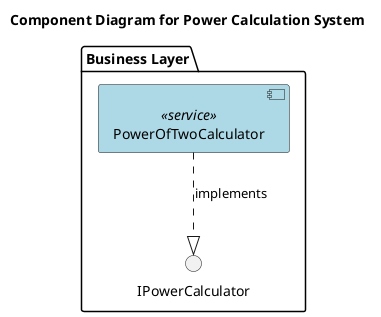
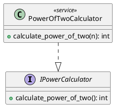

# Документация архитектуры PowerOfTwoCalculator

## Table of Contents

- [Обзор архитектуры](#обзор-архитектуры)
- [Компоненты и их ответственности](#компоненты-и-их-ответственности)
- [Слои приложения](#слои-приложения)
- [Паттерны проектирования](#паттерны-проектирования)
- [Структура проекта](#структура-проекта)
- [Зависимости между компонентами](#зависимости-между-компонентами)
- [Диаграммы](#диаграммы)
- [Решения и обоснования (ADR)](#решения-и-обоснования-adr)

## Обзор архитектуры

Архитектура PowerOfTwoCalculator представляет собой микросервис, реализованный на языке Python с использованием фреймворка Pydantic для моделей данных. Сервис предназначен для вычисления n-ой степени двойки и интегрируется в агентную архитектуру проекта. Он следует принципам модульной структуры с четкими интерфейсами, обеспечивая изоляцию и независимость развертывания. Архитектура основана на паттернах Strategy и Singleton, с бизнес-слоем для основной логики и FastAPI для экспозиции как веб-сервиса.

## Компоненты и их ответственности

### PowerOfTwoCalculator
- **Тип**: service
- **Описание**: Сервис для вычисления n-ой степени двойки.
- **Ответственность**: Принимает значение n и возвращает 2^n.
- **Методы**:
  - `calculate_power_of_two(n: int) -> int`: Вычисляет 2^n. Может вызывать ValueError.
- **Интерфейсы**: Реализует IPowerCalculator.
- **Слой**: business

## Слои приложения

Архитектура разделена на слои для обеспечения разделения ответственности:

- **Бизнес-слой**: Содержит основную логику вычислений (PowerOfTwoCalculator). Этот слой отвечает за реализацию бизнес-правил и интерфейсов.
- **Интерфейсный слой**: Включает FastAPI приложение (server.py) для экспозиции сервиса как микросервиса, с моделями данных на основе Pydantic.
- **Тестовый слой**: Содержит юнит-тесты для проверки функциональности.

## Паттерны проектирования

- **Strategy**: Используется для определения интерфейса IPowerCalculator, позволяя гибкую реализацию различных калькуляторов.
- **Singleton**: Может применяться для обеспечения единственного экземпляра сервиса в рамках микросервиса, хотя в предоставленных данных это не явно реализовано.

## Структура проекта

Проект организован в пакет `power_of_two_calculator` со следующей структурой файлов:

- `power_of_two_calculator/__init__.py`: Инициализация пакета, реэкспорт публичного API (PowerOfTwoCalculator, IPowerCalculator). Импортирует из `power_of_two_calculator.power_of_two_calculator` и `power_of_two_calculator.interfaces`.
- `power_of_two_calculator/interfaces.py`: Модуль с интерфейсами, включая IPowerCalculator. Экспортирует IPowerCalculator.
- `power_of_two_calculator/power_of_two_calculator.py`: Реализация сервиса PowerOfTwoCalculator. Импортирует из `power_of_two_calculator.interfaces`. Экспортирует PowerOfTwoCalculator.
- `power_of_two_calculator/models.py`: Pydantic модели для входных и выходных данных (PowerCalculationRequest, PowerCalculationResponse). Импортирует из pydantic. Экспортирует модели.
- `power_of_two_calculator/server.py`: FastAPI приложение для экспозиции сервиса. Содержит app и power_calculation_endpoint. Импортирует из fastapi, power_of_two_calculator.power_of_two_calculator и power_of_two_calculator.models. Экспортирует app.
- `tests/test_power_of_two_calculator.py`: Тесты для сервиса и интерфейсов. Импортирует из power_of_two_calculator.power_of_two_calculator и power_of_two_calculator.interfaces.

## Зависимости между компонентами

- PowerOfTwoCalculator зависит от IPowerCalculator (реализует интерфейс).
- FastAPI приложение (server.py) зависит от PowerOfTwoCalculator и моделей (models.py).
- Тесты зависят от PowerOfTwoCalculator и IPowerCalculator.
- Точки интеграции:
  - С "Project Manager Agent": Зависимость типа dependency. Project Manager Agent использует PowerOfTwoCalculator для вычислений в задачах. Требуемые изменения: добавить импорт в server.py, интегрировать вызовы в логику, обновить models.py при необходимости.
  - С "Logging Config": Интеграция типа utility_integration. PowerOfTwoCalculator использует централизованную конфигурацию логирования. Требуемые изменения: добавить импорт logging_config в файлы сервиса, настроить логирование.

## Диаграммы

### Component Diagram

### Class Diagram

## Решения и обоснования (ADR)

На основе рекомендаций по архитектуре приняты следующие решения:

1. **Интеграция как отдельный микросервис**: PowerOfTwoCalculator развертывается как независимый микросервис с асинхронной коммуникацией через message broker (например, RabbitMQ), чтобы снизить сложность и улучшить отказоустойчивость.
2. **Тестирование**: Внедрен комплексный набор тестов (юнит, интеграционные, нагрузочные) с использованием pytest для минимизации рисков регрессии.
3. **Оптимизация производительности**: Использование битовых сдвигов (1 << n) для O(1) сложности и кеширование для часто запрашиваемых значений.
4. **Безопасность**: Добавлена валидация входных данных (проверка на отрицательные n и переполнение), следуя принципам DDD.
5. **Расширяемость**: Архитектура следует Hexagonal Architecture с четкими интерфейсами для легкой интеграции дополнительных калькуляторов; рассмотрено введение API Gateway.
6. **Управление состоянием**: Внедрение централизованного состояния с Redis или Kafka для согласованности.
7. **Мониторинг**: Использование ELK Stack или Prometheus для логирования и мониторинга производительности.