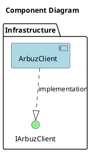
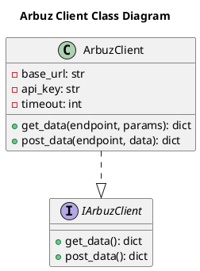

# Документация архитектуры

## Table of Contents

1. [Обзор архитектуры](#обзор-архитектуры)
2. [Компоненты и их ответственности](#компоненты-и-их-ответственности)
3. [Слои приложения](#слои-приложения)
4. [Паттерны проектирования](#паттерны-проектирования)
5. [Структура проекта](#структура-проекта)
6. [Зависимости между компонентами](#зависимости-между-компонентами)
7. [Диаграммы](#диаграммы)
8. [Решения и обоснования (ADR)](#решения-и-обоснования-adr)

## Обзор архитектуры

Архитектура проекта основана на многоагентной системе (multi-agent system), реализованной на языке Python с использованием фреймворка Pydantic для валидации данных. Основной новый компонент — ArbuzClient, который представляет собой сервис для взаимодействия с внешним API ARBUZ. Он интегрируется в существующую инфраструктуру, включая Project Manager Agent, Docker Compose и Logging Config, обеспечивая унифицированное логирование и оркестрацию контейнеров.

ArbuzClient отвечает за отправку запросов к внешнему API, обработку ответов и управление ошибками. Он реализован на инфраструктурном слое и использует паттерны проектирования для обеспечения модульности и расширяемости. Архитектура поддерживает интеграцию с существующими компонентами через зависимости и инфраструктурные изменения, такие как добавление сервиса в Docker Compose и настройка логирования.

## Компоненты и их ответственности

### ArbuzClient
- **Тип**: Сервис
- **Описание**: Клиент для взаимодействия с внешним API ARBUZ.
- **Ответственности**: 
  - Отправка запросов к ARBUZ API.
  - Обработка ответов.
  - Управление ошибками.
- **Свойства**:
  - `base_url` (str, required): Базовый URL для API.
  - `api_key` (str, required, private): Ключ для аутентификации в API.
  - `timeout` (int, required, default=30): Таймаут для запросов в секундах.
- **Методы**:
  - `get_data(endpoint: str, params: dict = {}) -> dict`: Получает данные из API по пути. Может вызывать APIError или TimeoutError.
  - `post_data(endpoint: str, data: dict) -> dict`: Отправляет данные в API. Может вызывать APIError или ValidationError.
- **Интерфейсы**: Реализует IArbuzClient.
- **Зависимости**: requests.
- **Слой**: Infrastructure.
- **Файл**: infrastructure/arbuz_client/client.py.

## Слои приложения

Архитектура разделена на слои для обеспечения разделения ответственности:

- **Infrastructure Layer**: Включает ArbuzClient, который обрабатывает взаимодействие с внешними API. Этот слой отвечает за низкоуровневые операции, такие как HTTP-запросы и управление зависимостями (например, requests). ArbuzClient размещен в этом слое, обеспечивая изоляцию внешних взаимодействий.

Другие слои (например, application или domain) не детализированы в предоставленных данных, поэтому описание ограничено реализованным.

## Паттерны проектирования

В архитектуре применяются следующие паттерны:

- **Facade**: ArbuzClient выступает как фасад для упрощения взаимодействия с внешним API ARBUZ, скрывая сложности HTTP-запросов и обработки ошибок.
- **Strategy**: Может использоваться для выбора стратегий обработки запросов (например, разные методы для GET и POST).
- **Chain of Responsibility**: Применяется для последовательной обработки ошибок и валидации.
- **Adapter**: ArbuzClient адаптирует внешний API к внутреннему интерфейсу IArbuzClient.
- **Singleton**: Может быть использован для управления единственным экземпляром ArbuzClient в системе.

Эти паттерны обеспечивают гибкость и модульность, но их применение ограничено реализованным кодом.

## Структура проекта

Структура файлов организована в пакеты для модульности:

- `infrastructure/arbuz_client/__init__.py`: Инициализация пакета, реэкспорт ArbuzClient и IArbuzClient. Импортирует из client и interfaces.
- `infrastructure/arbuz_client/interfaces.py`: Содержит интерфейс IArbuzClient. Импортирует abc.
- `infrastructure/arbuz_client/models.py`: Содержит Pydantic модели ArbuzRequest и ArbuzResponse. Импортирует pydantic.
- `infrastructure/arbuz_client/client.py`: Реализация ArbuzClient. Импортирует из interfaces и models.
- `tests/test_arbuz_client.py`: Тесты для ArbuzClient и IArbuzClient. Импортирует из client и interfaces.

## Зависимости между компонентами

- ArbuzClient зависит от requests для HTTP-запросов.
- ArbuzClient реализует IArbuzClient.
- Интеграция с существующими компонентами:
  - Project Manager Agent зависит от ArbuzClient для получения данных или задач.
  - Docker Compose включает ArbuzClient как сервис.
  - Logging Config используется ArbuzClient для логирования.

Зависимости описаны в точках интеграции, где указаны необходимые изменения, такие как импорт в agents/project_manager_agent/server.py и добавление сервиса в docker-compose.yaml.

## Диаграммы

### Component Diagram

### Class Diagram

## Решения и обоснования (ADR)

### ADR 1: Интеграция ArbuzClient с Project Manager Agent
**Решение**: Добавить зависимость ArbuzClient в Project Manager Agent для расширения координации пайплайна.  
**Обоснование**: Это позволяет агенту получать внешние данные, улучшая функциональность без изменения ядра системы. Изменения включают импорт, обновление логики и обработку ошибок, как указано в точках интеграции.

### ADR 2: Добавление ArbuzClient в Docker Compose
**Решение**: Включить ArbuzClient как новый сервис в docker-compose.yaml.  
**Обоснование**: Обеспечивает оркестрацию контейнеров, упрощая развертывание и управление зависимостями (порты, сети, volumes).

### ADR 3: Использование Logging Config в ArbuzClient
**Решение**: Импортировать logging_config.py и настроить логирование.  
**Обоснование**: Унифицирует логирование с архивацией и ротацией, улучшая наблюдаемость.

Рекомендации, такие как внедрение асинхронной коммуникации или разделение репозиториев, могут быть рассмотрены в будущем для оптимизации, но не реализованы в текущей архитектуре.