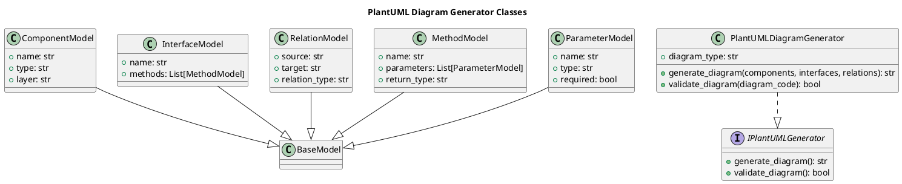

# Документация архитектуры PlantUML Diagram Generator

## Table of Contents

- [Обзор архитектуры](#обзор-архитектуры)
- [Компоненты и их ответственности](#компоненты-и-их-ответственности)
- [Слои приложения](#слои-приложения)
- [Паттерны проектирования](#паттерны-проектирования)
- [Структура проекта](#структура-проекта)
- [Зависимости между компонентами](#зависимости-между-компонентами)
- [Диаграммы](#диаграммы)
- [Решения и обоснования (ADR)](#решения-и-обоснования-adr)

## Обзор архитектуры

Система PlantUML Diagram Generator представляет собой набор компонентов, предназначенных для генерации PlantUML диаграмм на основе описания компонентов проекта. Архитектура построена на принципах multi-agent system, где компоненты взаимодействуют для создания текстового представления диаграмм, включая компоненты, интерфейсы и отношения. Основные технологии: Python с использованием фреймворка Pydantic для моделей данных.

Архитектура включает модели данных (ComponentModel, InterfaceModel, RelationModel, MethodModel, ParameterModel), сервис генерации диаграмм (PlantUMLDiagramGenerator) и интерфейсы (IPlantUMLGenerator). Компоненты организованы в бизнес-слой, с зависимостями от внешних агентов, таких как Architect Agent и Documentation Agent.

## Компоненты и их ответственности

### PlantUMLDiagramGenerator (service)
- **Описание**: Сервис для генерации PlantUML диаграмм на основе описания компонентов проекта.
- **Ответственность**: Создание текстового представления PlantUML диаграммы, включая компоненты, интерфейсы и отношения.
- **Свойства**:
  - `diagram_type` (str): Тип диаграммы (например, 'component' или 'class'), обязательный, по умолчанию 'component'.
- **Методы**:
  - `generate_diagram(components: List[ComponentModel], interfaces: List[InterfaceModel] = [], relations: List[RelationModel] = []) -> str`: Генерирует PlantUML код диаграммы. Может поднять ValueError.
  - `validate_diagram(diagram_code: str) -> bool`: Проверяет корректность сгенерированного PlantUML кода.
- **Реализует**: IPlantUMLGenerator.
- **Зависимости**: ComponentModel, InterfaceModel, RelationModel.
- **Слой**: business.

### ComponentModel (class)
- **Описание**: Модель для представления компонента в диаграмме.
- **Ответственность**: Хранение данных о компоненте для генерации диаграммы.
- **Свойства**:
  - `name` (str): Название компонента, обязательное.
  - `type` (str): Тип компонента (service, model и т.д.), обязательное.
  - `layer` (str): Слой архитектуры, обязательное.
- **Наследуется от**: BaseModel.
- **Слой**: business.

### InterfaceModel (class)
- **Описание**: Модель для представления интерфейса в диаграмме.
- **Ответственность**: Хранение данных об интерфейсе для генерации диаграммы.
- **Свойства**:
  - `name` (str): Название интерфейса, обязательное.
  - `methods` (List[MethodModel]): Список методов интерфейса, обязательное.
- **Наследуется от**: BaseModel.
- **Зависимости**: MethodModel.
- **Слой**: business.

### RelationModel (class)
- **Описание**: Модель для представления отношений между компонентами.
- **Ответственность**: Хранение данных об отношениях для генерации диаграммы.
- **Свойства**:
  - `source` (str): Источник отношения, обязательное.
  - `target` (str): Цель отношения, обязательное.
  - `relation_type` (str): Тип отношения (dependency, implementation и т.д.), обязательное.
- **Наследуется от**: BaseModel.
- **Слой**: business.

### MethodModel (class)
- **Описание**: Модель для представления метода в интерфейсе.
- **Ответственность**: Хранение данных о методе.
- **Свойства**:
  - `name` (str): Название метода, обязательное.
  - `parameters` (List[ParameterModel]): Список параметров, обязательное.
  - `return_type` (str): Тип возвращаемого значения, обязательное.
- **Наследуется от**: BaseModel.
- **Зависимости**: ParameterModel.
- **Слой**: business.

### ParameterModel (class)
- **Описание**: Модель для представления параметра метода.
- **Ответственность**: Хранение данных о параметре.
- **Свойства**:
  - `name` (str): Название параметра, обязательное.
  - `type` (str): Тип параметра, обязательное.
  - `required` (bool): Обязательность параметра, обязательное.
- **Наследуется от**: BaseModel.
- **Слой**: business.

## Слои приложения

Архитектура организована в один основной слой: **business**. Все компоненты (модели и сервис) находятся в этом слое, что отражает фокус на бизнес-логике генерации диаграмм. Нет разделения на presentation, application или infrastructure слои, так как система является частью multi-agent системы и интегрируется с внешними агентами (Architect Agent, Documentation Agent) через зависимости.

## Паттерны проектирования

В архитектуре применяются следующие паттерны:
- **Builder**: Для построения сложных моделей диаграмм (ComponentModel, InterfaceModel и т.д.).
- **Factory Method**: Для создания экземпляров моделей в зависимости от типа.
- **Strategy**: Для выбора стратегии генерации диаграмм в PlantUMLDiagramGenerator.
- **Composite**: Для композиции компонентов в диаграммах (например, InterfaceModel содержит MethodModel).
- **Visitor**: Для обхода и обработки моделей при генерации кода.
- **Repository**: Для абстракции доступа к данным моделей, хотя не реализован явно в предоставленных компонентах.

Основной паттерн системы: multi-agent system, где PlantUMLDiagramGenerator взаимодействует с агентами.

## Структура проекта

Проект организован в пакет `plantuml` с модулями:

- `plantuml/__init__.py` (package): Инициализация пакета, реэкспорт публичного API (ComponentModel, InterfaceModel, RelationModel, MethodModel, ParameterModel, PlantUMLDiagramGenerator). Импортирует из `plantuml.models` и `plantuml.generator`.
- `plantuml/models.py` (module): Модели данных (ComponentModel, InterfaceModel, RelationModel, MethodModel, ParameterModel), реализованные с Pydantic. Импортирует из `pydantic`.
- `plantuml/interfaces.py` (module): Интерфейсы (IPlantUMLGenerator). Импортирует из `abc`.
- `plantuml/generator.py` (module): Сервис PlantUMLDiagramGenerator. Импортирует из `plantuml.interfaces` и `plantuml.models`.
- `tests/test_plantuml_models.py` (test): Тесты для моделей (TestComponentModel, TestInterfaceModel, TestRelationModel, TestMethodModel, TestParameterModel). Импортирует из `plantuml.models`.
- `tests/test_plantuml_generator.py` (test): Тесты для сервиса (TestPlantUMLDiagramGenerator). Импортирует из `plantuml.generator` и `plantuml.interfaces`.

## Зависимости между компонентами

- PlantUMLDiagramGenerator зависит от ComponentModel, InterfaceModel, RelationModel.
- InterfaceModel зависит от MethodModel.
- MethodModel зависит от ParameterModel.
- Все модели наследуются от BaseModel.
- PlantUMLDiagramGenerator реализует IPlantUMLGenerator.

Точки интеграции:
- Architect Agent зависит от PlantUMLDiagramGenerator (dependency), ComponentModel, InterfaceModel, RelationModel, MethodModel, ParameterModel (composition). Требуются изменения в agents/architect_agent/server.py и models.py.
- Documentation Agent зависит от PlantUMLDiagramGenerator (dependency). Требуются изменения в agents/documentation_agent/server.py.

## Диаграммы

### Component Diagram

```plantuml
@startuml
title PlantUML Component Diagram for Diagram Generator

package "Business Layer" {
    component PlantUMLDiagramGenerator <<service>> #lightblue
    class ComponentModel #lightgreen
    class InterfaceModel #lightgreen
    class RelationModel #lightgreen
    class MethodModel #lightgreen
    class ParameterModel #lightgreen
    interface IPlantUMLGenerator
}

PlantUMLDiagramGenerator ..|> IPlantUMLGenerator : implements
PlantUMLDiagramGenerator --> ComponentModel : depends
PlantUMLDiagramGenerator --> InterfaceModel : depends
PlantUMLDiagramGenerator --> RelationModel : depends
InterfaceModel --> MethodModel : depends
MethodModel --> ParameterModel : depends

@enduml
```

### Class Diagram



## Решения и обоснования (ADR)

### ADR 1: Выбор Pydantic для моделей
**Контекст**: Необходимы модели данных с валидацией для компонентов диаграмм.  
**Решение**: Использовать Pydantic для BaseModel и наследников (ComponentModel и т.д.), так как он обеспечивает автоматическую валидацию и сериализацию.  
**Обоснование**: Упрощает код, повышает надежность данных.

### ADR 2: Интерфейс IPlantUMLGenerator
**Контекст**: Необходим абстрактный интерфейс для генератора диаграмм.  
**Решение**: Ввести IPlantUMLGenerator с методами generate_diagram и validate_diagram.  
**Обоснование**: Позволяет расширять систему новыми реализациями генераторов.

### ADR 3: Интеграция с multi-agent системой
**Контекст**: Система должна интегрироваться с Architect Agent и Documentation Agent.  
**Решение**: Использовать dependency и composition для моделей.  
**Обоснование**: Обеспечивает гибкость и повторное использование.

Рекомендации для улучшения:
- Внедрить Event-Driven Architecture (EDA) для асинхронного взаимодействия с брокерами вроде Kafka.
- Применить Domain-Driven Design (DDD) для bounded contexts.
- Ввести централизованное управление конфигурациями с HashiCorp Vault.
- Реализовать Circuit Breaker паттерн для внешних вызовов.
- Организовать contract testing и автоматизированные тесты.
- Оптимизировать с кэшированием в Redis.
- Улучшить расширяемость через Hexagonal Architecture.