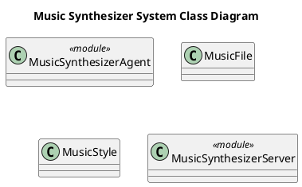

# Документация архитектуры MusicSynthesizerAgent

## Содержание

- [Обзор архитектуры](#обзор-архитектуры)
- [Компоненты и их ответственности](#компоненты-и-их-ответственности)
- [Слои приложения](#слои-приложения)
- [Паттерны проектирования](#паттерны-проектирования)
- [Структура проекта](#структура-проекта)
- [Зависимости между компонентами](#зависимости-между-компонентами)
- [Диаграммы](#диаграммы)
  - [Component Diagram](#component-diagram)
  - [Class Diagram](#class-diagram)
- [Решения и обоснования (ADR)](#решения-и-обоснования-adr)
- [Точки интеграции](#точки-интеграции)
- [Рекомендации](#рекомендации)

## Обзор архитектуры

MusicSynthesizerAgent — это модульный агент в составе AI-системы на базе Python и Pydantic, предназначенный для синтеза музыки на основе пользовательских спецификаций. Архитектура следует принципам модульных агентов (Modular Agents) и ориентирована на интеграцию в монолитную систему с другими агентами (например, ProjectManagerAgent).

Ключевые особенности:
- **Синтез музыки**: Генерация аудиофайлов с учетом стилей (жанр, темп, инструменты).
- **Модели данных**: Pydantic-модели для MusicFile (файл с метаданными и аудио) и MusicStyle (конфигурация стиля).
- **Серверная часть**: MusicSynthesizerServer для обработки запросов с интеграцией в инфраструктуру (OpenRouterMCP).
- **Тестирование**: Полное покрытие unit- и integration-тестами.
- **Интеграция**: Координация с существующими агентами через MCP (Modular Compute Platform).

Архитектура использует паттерны Strategy, Builder, Facade и Repository для гибкости и расширяемости.

## Компоненты и их ответственности

| Компонент              | Тип     | Ответственность |
|------------------------|---------|-----------------|
| **MusicSynthesizerAgent** | module | Синтез музыки на основе спецификаций пользователя, с поддержкой стилей музыки и Pydantic моделей. |
| **MusicFile**          | class  | Модель представления файла музыки с метаданными, действиями (экспорт, анализ) и аудиоданными. |
| **MusicStyle**         | class  | Конфигурация стиля музыки проекта (жанр, темп, инструменты, длительность, формат аудио). |
| **MusicSynthesizerServer** | module | Сервер агента для обработки запросов на синтез музыки с интеграцией в MCP и инфраструктуру. |

## Слои приложения

Архитектура разделена на слои для обеспечения separation of concerns:

1. **Domain Layer** (модели данных):
   - `MusicFile`, `MusicStyle` — Pydantic-модели для валидации и сериализации.

2. **Application Layer** (бизнес-логика):
   - `MusicSynthesizerAgent` — основной агент синтеза.

3. **Infrastructure Layer** (сервер и интеграции):
   - `MusicSynthesizerServer` — HTTP/гRPC-сервер с зависимостями от внешних сервисов (OpenRouterMCP).

4. **Test Layer**:
   - Unit-тесты для моделей, агента и сервера.

## Паттерны проектирования

- **Strategy**: Для переключения между алгоритмами синтеза музыки (например, разные AI-модели).
- **Builder**: Для построения сложных `MusicStyle` и `MusicFile` объектов поэтапно.
- **Facade**: `MusicSynthesizerServer` скрывает сложность агента от внешних клиентов.
- **Repository**: Для абстракции хранения/получения аудиофайлов и стилей (в будущем — с БД).

## Структура проекта

```
src/
└── agents/
    └── music_synthesizer_agent/
        ├── __init__.py          # Экспорт всех компонентов
        ├── models.py            # MusicFile, MusicStyle (Pydantic)
        ├── agent.py             # MusicSynthesizerAgent
        └── server.py            # MusicSynthesizerServer

tests/
├── test_music_synthesizer_agent_models.py   # TestMusicFile, TestMusicStyle
├── test_music_synthesizer_agent.py          # TestMusicSynthesizerAgent
└── test_music_synthesizer_agent_server.py   # TestMusicSynthesizerServer
```

| Файл | Тип | Описание | Содержит | Экспортирует |
|------|-----|----------|----------|--------------|
| `src/agents/music_synthesizer_agent/models.py` | module | Модели данных | MusicFile, MusicStyle | MusicFile, MusicStyle |
| `src/agents/music_synthesizer_agent/agent.py` | module | Основной агент | MusicSynthesizerAgent | MusicSynthesizerAgent |
| `src/agents/music_synthesizer_agent/server.py` | module | Сервер агента | MusicSynthesizerServer | MusicSynthesizerServer |
| `src/agents/music_synthesizer_agent/__init__.py` | package | Пакет агента | - | Все компоненты |
| `tests/test_music_synthesizer_agent_models.py` | test | Тесты моделей | TestMusicFile, TestMusicStyle | - |
| `tests/test_music_synthesizer_agent.py` | test | Тесты агента | TestMusicSynthesizerAgent | - |
| `tests/test_music_synthesizer_agent_server.py` | test | Тесты сервера | TestMusicSynthesizerServer | - |

## Зависимости между компонентами

- `agent.py` → `models.py` (импорт MusicFile, MusicStyle).
- `server.py` → `agent.py`, `models.py`.
- `__init__.py` → экспорт всех.
- Внешние: Pydantic; интеграции с ProjectManagerAgent, OpenRouterMCP.

## Диаграммы

### Component Diagram

```plantuml
@startuml
!theme plain
title Music Synthesizer Components Diagram

skinparam component<<module>> {
  BackgroundColor SteelBlue
  BorderColor Navy
  FontColor White
}
skinparam class {
  BackgroundColor LightGreen
  BorderColor DarkGreen
}
skinparam component<<external>> {
  BackgroundColor Orange
  BorderColor Red
}
skinparam package {
  BackgroundColor LightGray
  BorderColor Gray
}

package "Modules" {
  component "MusicSynthesizerAgent" as MSA <<module>>
  component "MusicSynthesizerServer" as MSS <<module>>
}

package "Domain Classes" {
  class MusicFile
  class MusicStyle
}

component "OpenRouterMCP" as ORM <<external>>
component "ProjectManagerAgent" as PMA <<external>>

MSS ..> ORM : dependency
MSA ..> PMA : dependency

@enduml
```

### Class Diagram



## Решения и обоснования (ADR)

| ADR ID | Решение | Обоснование |
|--------|---------|-------------|
| ADR-001 | Использование Pydantic для моделей | Строгая валидация, типизация, сериализация JSON; совместимость с FastAPI/сервером. |
| ADR-002 | Модульная структура в `src/agents/` | Легкость интеграции в монолит; изоляция агентов. |
| ADR-003 | Асинхронный сервер (asyncio) | Обработка CPU-intensive задач синтеза без блокировок. |
| ADR-004 | Паттерны Strategy/Builder | Гибкость для новых стилей/синтезаторов (Magenta → Riffusion). |

## Точки интеграции

| Существующий компонент | Новый компонент | Тип | Описание | Изменения |
|------------------------|-----------------|-----|----------|-----------|
| ProjectManagerAgent | MusicSynthesizerAgent | coordination | Координация задач по музыке | Импорт/регистрация; обновление логики; расширение models.py |
| ArchitectAgent | MusicSynthesizerAgent | design | Проектирование спецификаций | Расширение models.py/server.py |
| OpenRouterMCP | MusicSynthesizerServer | infrastructure | AI-модели для синтеза | Docker-compose, .env, README |
| DocumentationAgent | MusicSynthesizerAgent | documentation | Генерация docs | Расширение models.py/server.py |
| CodeReviewerAgent | MusicFile | review | Ревью MusicFile | Обновление models.py |

## Рекомендации

- Ввести shared models пакет (`shared/models/`) для MusicFile/MusicStyle.
- Разработать OrchestratorAgent на базе project_manager_agent с message queue (Redis/RabbitMQ).
- Применить DI (`injector`/`dependency-injector`) для тестируемости.
- Добавить pytest + GitHub Actions CI/CD.
- Асинхронность (Celery) + caching для MusicStyle.
- Валидация Pydantic + rate limiting (Flask-Limiter).
- Hexagonal Architecture для портов/адаптеров.