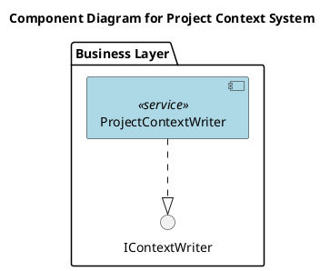
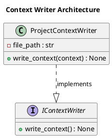

# Документация архитектуры проекта

## Содержание

- [Обзор архитектуры](#обзор-архитектуры)
- [Компоненты и их ответственности](#компоненты-и-их-ответственности)
- [Слои приложения](#слои-приложения)
- [Паттерны проектирования](#паттерны-проектирования)
- [Структура проекта](#структура-проекта)
- [Зависимости между компонентами](#зависимости-между-компонентами)
- [Диаграммы](#диаграммы)
- [Решения и обоснования (ADR)](#решения-и-обоснования-adr)

## Обзор архитектуры

Архитектура проекта основана на агентно-ориентированном подходе с использованием микросервисов. Основной компонент — сервис `ProjectContextWriter`, который отвечает за запись контекста проекта в файл `everything.txt`. Сервис реализован на языке Python с использованием фреймворка Pydantic для валидации данных. Архитектура включает бизнес-слой для логики приложения и интеграцию с существующими агентами проекта, такими как Project Manager Agent, Architect Agent и другими. Проект использует паттерны Builder, Facade и Strategy для организации кода.

## Компоненты и их ответственности

### ProjectContextWriter
- **Тип**: Сервис
- **Описание**: Сервис для записи контекста проекта в файл `everything.txt`.
- **Ответственность**: Принимает контекст из GitHub и кратко записывает всю информацию в один файл.
- **Свойства**:
  - `file_path` (str): Путь к файлу для записи. Обязательный. По умолчанию: "everything.txt". Не приватное, не readonly.
- **Методы**:
  - `write_context(context: dict) -> None`: Записывает предоставленный контекст в файл. Может вызвать IOError.
- **Интерфейсы**: Реализует `IContextWriter`.
- **Зависимости**: Нет.
- **Файл**: `business/project_context_writer.py`.
- **Слой**: business.

## Слои приложения

Проект разделен на следующие слои:
- **Business Layer**: Содержит бизнес-логику, включая сервис `ProjectContextWriter` и интерфейс `IContextWriter`. Этот слой отвечает за обработку контекста проекта и его запись.

## Паттерны проектирования

В проекте используются следующие паттерны:
- **Builder**: Для пошагового построения объектов контекста.
- **Facade**: Для упрощения интерфейса взаимодействия с компонентами.
- **Strategy**: Для выбора различных стратегий записи контекста.

## Структура проекта

Структура файлов проекта включает:
- `business/__init__.py`: Инициализация пакета business, реэкспорт публичного API для компонентов бизнес-логики. Импортирует из `business.project_context_writer` и `business.i_context_writer`. Экспортирует `ProjectContextWriter` и `IContextWriter`.
- `business/project_context_writer.py`: Реализация сервиса `ProjectContextWriter`. Содержит класс `ProjectContextWriter`. Импортирует из `business.i_context_writer`. Экспортирует `ProjectContextWriter`.
- `business/i_context_writer.py`: Интерфейс `IContextWriter`. Содержит интерфейс `IContextWriter`. Нет импортов. Экспортирует `IContextWriter`.
- `tests/test_project_context_writer.py`: Тесты для сервиса `ProjectContextWriter`. Содержит класс `TestProjectContextWriter`. Импортирует из `business.project_context_writer`. Нет экспортов.

## Зависимости между компонентами

- `ProjectContextWriter` реализует интерфейс `IContextWriter`.
- Интеграция с существующими компонентами:
  - **Project Manager Agent**: Зависит от `ProjectContextWriter` для записи контекста во время координации задач.
  - **Architect Agent**: Зависит от `ProjectContextWriter` для записи архитектурных решений.
  - **Code Writer Agent**: Зависит от `ProjectContextWriter` для чтения контекста и записи кода.
  - **Code Reviewer Agent**: Зависит от `ProjectContextWriter` для чтения контекста и записи отзывов.
  - **Documentation Agent**: Зависит от `ProjectContextWriter` для чтения контекста и записи документации.
  - **OpenRouter Proxy**: Опциональная зависимость для логирования контекста запросов.

## Диаграммы

### Component Diagram

### Class Diagram

## Решения и обоснования (ADR)

### Рекомендации по архитектуре
- Внедрить API Gateway для централизованного управления межсервисным взаимодействием, что снизит сложность синхронизации и улучшит масштабируемость архитектуры микросервисов.
- Организовать интеграционные тесты с использованием инструментов вроде Pact для contract testing, чтобы обеспечить надежность взаимодействия между сервисами и предотвратить регрессии.
- Оптимизировать производительность путем внедрения кэширования ответов от OpenRouter (например, с Redis) и асинхронной обработки запросов, чтобы минимизировать задержки и снизить нагрузку на внешние LLM.
- Усилить безопасность путем добавления аутентификации и авторизации (OAuth2/JWT), шифрования данных в транзите и rate limiting для вызовов внешних API, чтобы защитить от атак и утечек.
- Повысить расширяемость за счет применения паттернов DDD (Domain-Driven Design) внутри сервисов и использования event-driven архитектуры (с брокерами сообщений вроде Kafka), что позволит легко добавлять новые компоненты, такие как ProjectContextWriter, без нарушения существующих зависимостей.
- Внедрить мониторинг и логирование с инструментами вроде ELK Stack или Prometheus для отслеживания производительности и ошибок, что поможет в быстрой диагностике проблем в микросервисной среде.
- Перейти на контейнеризацию с Kubernetes для упрощения развертывания и управления множеством сервисов, снижая риски ручных ошибок и улучшая отказоустойчивость.