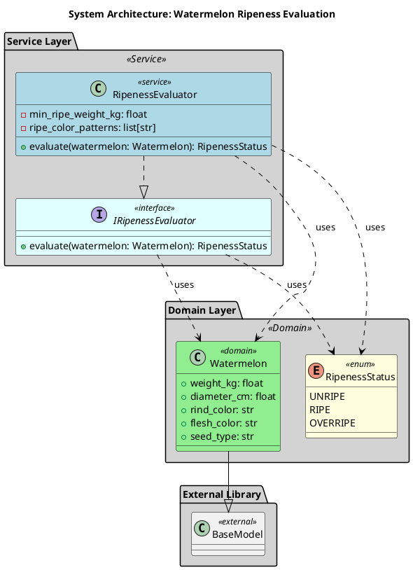
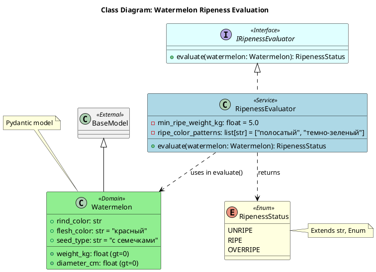

# Архитектура системы оценки спелости арбузов

## Table of Contents

- [Обзор архитектуры](#обзор-архитектуры)
- [Компоненты и их ответственности](#компоненты-и-их-ответственности)
- [Слои приложения](#слои-приложения)
- [Паттерны проектирования](#паттерны-проектирования)
- [Структура проекта](#структура-проекта)
- [Зависимости между компонентами](#зависимости-между-компонентами)
- [Диаграммы](#диаграммы)
    - [Component Diagram](#component-diagram)
    - [Class Diagram](#class-diagram)
- [Решения и обоснования (ADR)](#решения-и-обоснования-adr)

---

## Обзор архитектуры

Система предназначена для оценки зрелости арбузов на основе их физических характеристик. Архитектура построена по принципам чистой архитектуры с четким разделением на доменный и сервисный слои.

Основная задача — получить данные об арбузе (вес, размер, цвет) и определить его состояние (незрелый, спелый, перезрелый) с помощью специализированного сервиса.

Ключевые особенности:
- **Доменно-ориентированный подход**: Основная бизнес-логика инкапсулирована в доменных сущностях (`Watermelon`, `RipenessStatus`).
- **Слабая связанность**: Взаимодействие между слоями происходит через четко определенные интерфейсы (протоколы), что обеспечивает гибкость и тестируемость.
- **Использование Pydantic**: Для валидации и сериализации данных доменной модели `Watermelon` используется библиотека Pydantic, что гарантирует целостность данных на уровне модели.

---

## Компоненты и их ответственности

### `Watermelon`
- **Тип**: Класс (Pydantic модель)
- **Слой**: Domain
- **Описание**: Представляет арбуз с его основными характеристиками. Использует Pydantic для валидации данных.
- **Ответственность**: Хранение и валидация данных об арбузе, таких как вес, размер и цвет.
- **Свойства**:
    - `weight_kg: float` (обязательное): Вес арбуза в килограммах. Должен быть больше 0.
    - `diameter_cm: float` (обязательное): Диаметр арбуза в сантиметрах. Должен быть больше 0.
    - `rind_color: str` (обязательное): Цвет корки (например, 'полосатый', 'темно-зеленый').
    - `flesh_color: str` (обязательное, по умолчанию 'красный'): Цвет мякоти.
    - `seed_type: str` (обязательное, по умолчанию 'с семечками'): Тип семян.
- **Наследует**: `pydantic.BaseModel`

### `RipenessStatus`
- **Тип**: Enum
- **Слой**: Domain
- **Описание**: Перечисление, описывающее возможные состояния зрелости арбуза.
- **Ответственность**: Представление статуса зрелости в виде типобезопасного перечисления.
- **Наследует**: `str, Enum`

### `RipenessEvaluator`
- **Тип**: Сервис
- **Слой**: Service
- **Описание**: Сервис для оценки зрелости арбуза на основе его характеристик.
- **Ответственность**: Определение степени зрелости арбуза по набору эвристик.
- **Свойства**:
    - `_min_ripe_weight_kg: float` (приватное): Минимальный вес для считывания арбуза зрелым (по умолчанию 5.0).
    - `_ripe_color_patterns: list[str]` (приватное): Список цветовых паттернов, характерных для зрелых арбузов (по умолчанию ['полосатый', 'темно-зеленый']).
- **Методы**:
    - `evaluate(watermelon: Watermelon) -> RipenessStatus`: Оценивает зрелость переданного арбуза. Может вызывать `ValueError`.
- **Реализует**: `IRipenessEvaluator`
- **Зависимости**: `Watermelon`, `RipenessStatus`

---

## Слои приложения

Архитектура разделена на два основных слоя, что способствует разделению ответственности и упрощает поддержку и развитие системы.

### 1. Domain Layer (Доменный слой)
- **Назначение**: Содержит бизнес-сущности и правила, которые являются ядром предметной области.
- **Компоненты**:
    - `Watermelon`: Основная модель данных, представляющая арбуз.
    - `RipenessStatus`: Перечисление, определяющее возможные статусы зрелости.
- **Особенности**: Этот слой не зависит от других слоев приложения или инфраструктурных деталей. Он содержит только бизнес-логику и данные.

### 2. Service Layer (Сервисный слой)
- **Назначение**: Инкапсулирует логику приложения, оркестрирует работу доменных объектов и реализует варианты использования (use cases).
- **Компоненты**:
    - `IRipenessEvaluator`: Интерфейс (протокол) для оценки зрелости, обеспечивающий слабую связанность.
    - `RipenessEvaluator`: Конкретная реализация сервиса оценки зрелости.
- **Особенности**: Зависит от доменного слоя. Использует интерфейсы для определения контрактов, что позволяет легко заменять реализации (например, для тестирования).

---

## Паттерны проектирования

В архитектуре системы использованы следующие паттерны проектирования:

- **Data Transfer Object (DTO) / Value Object**: Класс `Watermelon` выступает в роли DTO/Value Object. Он инкапсулирует данные и обеспечивает их валидацию через Pydantic. Это делает передачу данных между слоями безопасной и структурированной.

- **Strategy (Стратегия)**: Хотя в текущей реализации присутствует только один алгоритм оценки (`RipenessEvaluator`), архитектура предполагает его использование. Определение интерфейса `IRipenessEvaluator` позволяет в будущем легко добавлять новые стратегии оценки (например, по звуку при постукивании, по температуре) и выбирать их во время выполнения.

- **Dependency Injection (Внедрение зависимостей)**: Сервис `RipenessEvaluator` проектируется так, чтобы его можно было внедрять в компоненты более высокого уровня (например, в обработчики API-эндпоинтов), а не создавать их напрямую. Это улучшает тестируемость и гибкость.

---

## Структура проекта

Проект организован в виде пакета `my_project`, который, в свою очередь, разделен на подпакеты, соответствующие слоям архитектуры.

```
src/
└── my_project/
    ├── domain/
    │   ├── __init__.py
    │   └── watermelon.py
    │
    └── service/
        ├── __init__.py
        ├── protocols.py
        └── ripeness_evaluator.py

tests/
├── test_domain/
│   └── test_watermelon.py
│
└── test_service/
    └── test_ripeness_evaluator.py
```

### Описание файлов и модулей

- **`src/my_project/domain/watermelon.py`**: Содержит доменную модель `Watermelon` и перечисление `RipenessStatus`. Это ядро бизнес-логики.
- **`src/my_project/domain/__init__.py`**: Реэкспортирует `Watermelon` и `RipenessStatus` для удобного импорта из других частей проекта.
- **`src/my_project/service/protocols.py`**: Определяет интерфейс `IRipenessEvaluator`. Это ключевой элемент для достижения слабой связанности.
- **`src/my_project/service/ripeness_evaluator.py`**: Содержит конкретную реализацию `RipenessEvaluator`, которая следует логике, определенной в `IRipenessEvaluator`.
- **`src/my_project/service/__init__.py`**: Реэкспортирует `IRipenessEvaluator` и `RipenessEvaluator` для внешнего использования.
- **`tests/`**: Каталог с тестами, структурированный аналогично основному коду для легкого поиска тестов для конкретных модулей.

---

## Зависимости между компонентами

Взаимодействие между компонентами построено на принципе зависимости от абстракций, а не от конкретных реализаций.

- **`RipenessEvaluator`** зависит от:
    - `Watermelon`: Использует его в качестве входных данных для метода `evaluate`.
    - `RipenessStatus`: Использует его как тип возвращаемого значения.
    - `IRipenessEvaluator`: Реализует этот интерфейс.

- **`Watermelon`** зависит от:
    - `pydantic.BaseModel`: Наследуется от него для получения функционала валидации и сериализации.

- **`IRipenessEvaluator`** (интерфейс) зависит от:
    - `Watermelon`: Использует его в сигнатуре метода `evaluate`.
    - `RipenessStatus`: Использует его в качестве возвращаемого типа.

Граф зависимостей направлен от сервисного слоя к доменному, что является правильной практикой в чистой архитектуре.

---

## Диаграммы

### Component Diagram

Диаграмма компонентов показывает высокоуровневую структуру системы и взаимодействие между ее основными частями.



### Class Diagram

Диаграмма классов детализирует структуру каждого компонента, их атрибуты, методы и отношения между ними.



---

## Решения и обоснования (ADR)

#### ADR-001: Использование Pydantic для модели `Watermelon`
- **Статус**: Принято
- **Контекст**: Необходимо было определить модель для хранения данных об арбузе с обязательной валидацией.
- **Решение**: Использовать библиотеку Pydantic для создания класса `Watermelon`.
- **Обоснование**:
    - **Автоматическая валидация**: Pydantic автоматически проверяет типы и ограничения (например, `gt=0` для веса и диаметра), что предотвращает создание некорректных объектов.
    - **Сериализация/Десериализация**: Упрощает преобразование объектов в/из JSON, что полезно для API или работы с конфигурациями.
    - **Читаемость**: Код модели становится декларативным и легким для понимания.
- **Последствия**: Проект получает зависимость от библиотеки `pydantic`. Это стандартная и широко используемая зависимость в современном Python-экосистеме, поэтому негативные последствия минимальны.

#### ADR-002: Определение `RipenessStatus` как Enum
- **Статус**: Принято
- **Контекст**: Требовалось представить статусы зрелости (незрелый, спелый и т.д.) типобезопасным способом.
- **Решение**: Создать перечисление `RipenessStatus`, наследуемое от `str` и `Enum`.
- **Обоснование**:
    - **Типобезопасность**: Исключает возможность использования опечаток или случайных строк в коде. IDE и статические анализаторы смогут отловить ошибки на этапе разработки.
    - **Читаемость**: Код становится самодокументируемым (`RipenessStatus.RIPE` понятнее, чем строка `"ripe"`).
    - **Совместимость**: Наследование от `str` позволяет легко сериализовать enum в JSON без дополнительной логики.
- **Последствия**: Никаких негативных последствий. Это стандартная практика в Python для представления набора констант.

#### ADR-003: Использование интерфейса `IRipenessEvaluator`
- **Статус**: Принято
- **Контекст**: Сервис оценки зрелости может иметь разные алгоритмы или потребоваться его замена для тестов.
- **Решение**: Определить интерфейс `IRipenessEvaluator` (протокол в Python) и реализовать его в классе `RipenessEvaluator`.
- **Обоснование**:
    - **Слабая связанность**: Компоненты, использующие сервис, будут зависеть от абстракции (`IRipenessEvaluator`), а не от конкретной реализации. Это соответствует принципу инверсии зависимостей (SOLID).
    - **Тестируемость**: В unit-тестах можно легко подменить реальный `RipenessEvaluator` на мок-объект, реализующий тот же интерфейс.
    - **Расширяемость**: В будущем можно добавить новые классы, реализующие `IRipenessEvaluator` (например, `SoundRipenessEvaluator`), не изменяя код клиентских компонентов.
- **Последствия**: Добавляется один дополнительный файл (`protocols.py`), что незначительно усложняет структуру, но выигрыш в гибкости и качестве кода перевешивает этот недостаток.