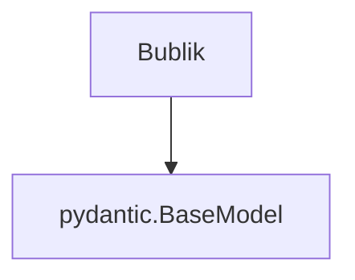
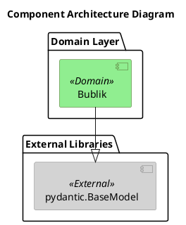
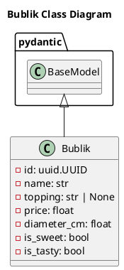

# Архитектура компонента Bublik

## Table of Contents

1.  [Обзор архитектуры](#обзор-архитектуры)
2.  [Компоненты и их ответственности](#компоненты-и-их-ответственности)
3.  [Слои приложения](#слои-приложения)
4.  [Паттерны проектирования](#паттерны-проектирования)
5.  [Структура проекта](#структура-проекта)
6.  [Зависимости между компонентами](#зависимости-между-компонентами)
7.  [Диаграммы](#диаграммы)
    *   [Component Diagram](#component-diagram)
    *   [Class Diagram](#class-diagram)
8.  [Решения и обоснования (ADR)](#решения-и-обоснования-adr)

---

### Обзор архитектуры

Данный документ описывает архитектуру компонента `Bublik`. `Bublik` является моделью данных (сущностью предметной области), предназначенной для представления сладкого вкусного бублика. Компонент реализован с использованием библиотеки `Pydantic` для обеспечения строгой валидации данных.

Основная ответственность `Bublik` — хранить и управлять атрибутами, такими как уникальный идентификатор, название, начинка, цена и физические характеристики бублика. Компонент спроектирован как чистый доменный объект и располагается в слое `Domain`.

В будущем на основе этой модели планируется создание сервиса-оркестратора, который будет взаимодействовать с другими агентами в системе.

---

### Компоненты и их ответственности

#### Bublik

**Тип:** `class` (Pydantic модель)  
**Слой:** Domain  
**Описание:** Модель данных для представления сладкого вкусного бублика.

**Ответственности:**
*   Хранение атрибутов бублика.
*   Валидация данных при создании и изменении экземпляра.
*   Автоматическая генерация уникального идентификатора (`id`).

**Свойства:**

| Свойство      | Тип             | Описание                                                              | Обязательное | По умолчанию |
|---------------|-----------------|-----------------------------------------------------------------------|--------------|--------------|
| `id`          | `uuid.UUID`     | Уникальный идентификатор бублика. Генерируется автоматически.         | Да           | `uuid.uuid4` |
| `name`        | `str`           | Название бублика, например, 'С маком' или 'Корица с сахаром'.         | Да           | -            |
| `topping`     | `str \| None`   | Основная посыпка или начинка. Может быть отсутствовать.               | Да           | `None`       |
| `price`       | `float`         | Цена бублика. Должна быть положительным числом.                       | Да           | -            |
| `diameter_cm` | `float`         | Диаметр бублика в сантиметрах. Должен быть положительным числом.      | Да           | -            |
| `is_sweet`    | `bool`          | Флаг, указывающий, что бублик сладкий.                                | Да           | `true`       |
| `is_tasty`    | `bool`          | Флаг, указывающий, что бублик вкусный.                                | Да           | `true`       |

**Зависимости:**
*   `pydantic`: Наследуется от `pydantic.BaseModel`.
*   `uuid`: Используется для генерации уникальных идентификаторов.

---

### Слои приложения

Архитектура проекта следует принципам разделения на слои. Компонент `Bublik` находится в слое **Domain**.

*   **Domain Layer (Слой предметной области):**
    *   Содержит бизнес-логику и сущности ядра системы.
    *   Компонент `Bublik` является чистой моделью данных этого слоя, не зависящей от инфраструктуры (например, баз данных или API).
    *   Этот слой определяет "что" делает система, а не "как".

*   **Application Layer (Слой приложения):**
    *   (Планируется) Здесь будет располагаться логика оркестрации, которая использует `Bublik` для координации работы между различными агентами.

*   **Infrastructure Layer (Инфраструктурный слой):**
    *   (Планируется) Содержит код для взаимодействия с внешними системами: HTTP-клиенты для вызова других агентов, работа с конфигурацией, логирование.

---

### Паттерны проектирования

На текущем этапе в коде самого компонента `Bublik` не используется каких-либо явных паттернов проектирования, за исключением наследования от `pydantic.BaseModel`, что является стандартной практикой для создания моделей данных в Pydantic.

Однако, в соответствии с [рекомендациями](#решения-и-обоснования-adr), для дальнейшего развития системы предлагается внедрить следующие паттерны:
*   Чистая архитектура (Clean Architecture) / Портированная архитектура (Hexagonal Architecture)
*   Service Discovery
*   Circuit Breaker
*   Repository (для взаимодействия с хранилищем, если оно потребуется)

---

### Структура проекта

Файлы, связанные с компонентом `Bublik`, организованы следующим образом:

```
src/
└── my_project/
    └── domain/
        ├── __init__.py         # Инициализация пакета, реэкспорт `Bublik`
        └── bublik.py           # Определение класса `Bublik`

tests/
└── test_domain/
    └── test_bublik.py         # Тесты для класса `Bublik`
```

**Описание файлов:**

*   `src/my_project/domain/__init__.py`: Инициализация пакета `domain`. Реэкспортирует сущность `Bublik` для предоставления чистого публичного API.
*   `src/my_project/domain/bublik.py`: Модуль, содержащий определение класса `Bublik`, наследуемого от `pydantic.BaseModel`.
*   `tests/test_domain/test_bublik.py`: Модуль с тестами для проверки корректности валидации и логики класса `Bublik`.

---

### Зависимости между компонентами

#### Текущие зависимости

Компонент `Bublik` напрямую зависит только от внешней библиотеки `pydantic`.



#### Требуемые интеграции

На основе предоставленных точек интеграции, сервис, построенный вокруг `Bublik`, будет взаимодействовать со следующими компонентами системы:

*   **`agents/project_manager_agent/server.py`**
    *   **Тип интеграции:** Зависимость.
    *   **Описание:** `ProjectManagerAgent` будет делегировать сложные рабочие процессы новому сервису-оркестратору на основе `Bublik`.
    *   **Требуемые изменения:**
        1.  Создать новый файл для компонента-оркестратора.
        2.  В `ProjectManagerAgent` добавить импорт и создание экземпляра оркестратора.
        3.  Добавить новый эндпоинт в `ProjectManagerAgent` для запуска оркестрации.

*   **`agents/code_writer_agent/server.py`, `agents/architect_agent/server.py`, и другие агенты**
    *   **Тип интеграции:** Клиент-сервер.
    *   **Описание:** Сервис `Bublik` будет выступать в роли клиента, вызывая API отдельных агентов.
    *   **Требуемые изменения:**
        1.  Реализовать в сервисе `Bublik` HTTP-клиенты для взаимодействия с серверами агентов.
        2.  Убедиться, что серверы агентов имеют необходимые эндпоинты.

*   **`logging_config.py`**
    *   **Тип интеграции:** Зависимость.
    *   **Описание:** Сервис `Bublik` должен использовать централизованную конфигурацию логирования.
    *   **Требуемые изменения:**
        1.  Импортировать и настроить логгер из `logging_config.py` в коде сервиса `Bublik`.

*   **`.env.example`**
    *   **Тип интеграции:** Конфигурация.
    *   **Описание:** Адреса других агентов и параметры сервиса `Bublik` должны управляться через переменные окружения.
    *   **Требуемые изменения:**
        1.  Добавить в `.env.example` новые переменные (например, `BUBLIK_HOST`, `CODE_WRITER_AGENT_URL`).

---

### Диаграммы

#### Component Diagram



#### Class Diagram



---

### Решения и обоснования (ADR)

В этом разделе собраны рекомендации по дальнейшему развитию архитектуры, представленные в формате записей о решениях (Architecture Decision Records).

#### ADR-001: Внедрение чистой архитектуры (Clean Architecture)

*   **Статус:** Предложено
*   **Контекст:** Текущая реализация `Bublik` — это простая модель. При развитии сервиса-оркестратора возникнет риск высокой связанности бизнес-логики с инфраструктурными деталями (HTTP-клиенты, конфигурация), что усложнит тестирование и поддержку.
*   **Решение:** Внедрить портированную (Hexagonal) или чистую архитектуру (Clean Architecture) для изоляции бизнес-логики сервиса `Bublik` от инфраструктурных concerns. Класс `Bublik` должен остаться чистым доменным объектом, а его взаимодействие с внешним миром должно происходить через порты (интерфейсы).
*   **Обоснование:** Это создаст четкие границы между слоями, сделает бизнес-логику независимой и легко тестируемой, а также повысит гибкость системы при замене внешних зависимостей.

#### ADR-002: Реализация Service Discovery

*   **Статус:** Предложено
*   **Контекст:** Интеграция с другими агентами требует знания их сетевых адресов. Жесткое кодирование URL в коде делает систему хрупкой и сложной для развертывания в разных средах.
*   **Решение:** Реализовать паттерн 'Service Discovery' (например, с использованием Consul) и вынести все URL в конфигурацию, управляемую через переменные окружения.
*   **Обоснование:** Это устранит "жестко закодированные URL", повысит отказоустойчивость (сервис сможет динамически находить доступные инстансы) и масштабируемость системы.

#### ADR-003: Интеграция брокера сообщений

*   **Статус:** Предложено
*   **Контекст:** Оркестрация нескольких агентов может включать длительные асинхронные операции. Синхронное ожидание ответов от всех участников может привести к блокировкам и снижению производительности.
*   **Решение:** Для асинхронных операций (например, создание или уведомление о новых `Bublik`) интегрировать брокер сообщений (RabbitMQ, Kafka).
*   **Обоснование:** Внедрение очереди сообщений позволит декомпозировать сложные рабочие процессы, улучшить производительность и отзывчивость системы, а также обеспечить надежную доставку сообщений.

#### ADR-004: Внедрение паттерна Circuit Breaker

*   **Статус:** Предложено
*   **Контекст:** Сервис `Bublik` будет зависеть от множества других агентов. Недоступность одного из них может привести к каскадным сбоям во всей системе оркестрации.
*   **Решение:** При интеграции с другими сервисами внедрить паттерн 'Circuit Breaker' (например, с помощью библиотеки `Resilience4j` или аналогов для Python).
*   **Обоснование:** Это защитит систему от каскадных сбоев. "Автоматический выключатель" будет временно прекращать вызовы к "падающему" сервису, позволяя системе остаться работоспособной и предоставлять деградированный, но стабильный функционал.

#### ADR-005: Внедрение распределенной трассировки

*   **Статус:** Предложено
*   **Контекст:** В распределенной системе, состоящей из множества агентов и оркестратора, отладка запросов становится крайне сложной задачей. Отсутствие единого взгляда на путь запроса по всем сервисам затрудняет поиск узких мест и ошибок.
*   **Решение:** С самого начала внедрить распределенную трассировку (Distributed Tracing), например, с использованием OpenTelemetry и Jaeger.
*   **Обоснование:** Это критически важно для отладки в распределенной среде. Трассировка позволит отслеживать полный путь каждого запроса, измерять задержки на каждом этапе и быстро идентифицировать проблемы.